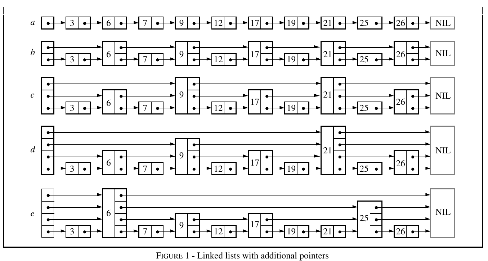
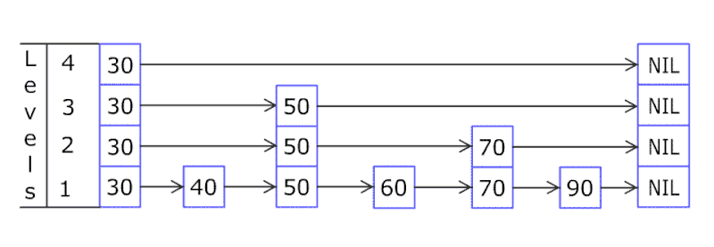

# SKIP LIST

## 引子-有序单向链表
每个元素存放下一个元素的引用，但是要查找某个元素，需要从头开始遍历，时间复杂度为O(n)

在有序单向链表的基础上，如果能增加索引，那么获取某个元素的时间复杂度就可以降低为

通常降低为 O(logn) 的复杂度，需要使用二分查找，但是二分查找需要数组，而链表是无法使用二分查找的。

因为链表不能做到 random access。

如果我们的索引是每间隔一半的元素而递归地建立，或许我们就可以使用二分查找了。

按照这个思路，我们或许需要建立多级索引，每级索引的元素间隔为上一级索引的元素的一半。

一旦能应用上二分查找，那么这种结构在时间复杂度上就等同于红黑树了。

## 跳表

### 与 rbtree 的比较
1. 都可以插入、删除、查找，时间复杂度都为 O(logn)
2. 都可以有序遍历
3. 唯一不同的是，跳表可以进行范围查找，但是红黑树可以，但是效率低下

### Insert

每个元素插入时要随机生成level

最底层的链表里面存放了所有的元素

如果一个元素出现在第 i 层索引中，那么它一定会出现在 i 以下的层中

索引层有两个指向，一个指向下一个元素（逻辑上指向），一个指向下一层索引的元素

### Remove

跳表中，每一层索引其实都是一个有序的单链表，单链表删除元素的时间复杂度为 O(1)，索引层数为 logn 表示最多需要删除 logn 个元素，所以删除元素的总时间包含 查找元素的时间 加 删除 logn个元素的时间 为 O(logn) + O(logn) = 2 O(logn)，忽略常数部分，删除元素的时间复杂度为 O(logn)。

## 无锁并发跳表

### 无锁删除

- 铰接点：指的是当前结点的前一个结点

### EBR (epoch based reclamation)
基于世代的回收算法。引入经典的读、删并发场景。

例如链表读取的线程在读取节点N，但N节点已经被另一个并发线程删除，由于存在线程任意顺序执行的组合，读线程可能拿到了一个删除且回收的节点。

# References

https://www.jianshu.com/p/9d8296562806

https://zhuanlan.zhihu.com/p/600729377

https://zhuanlan.zhihu.com/p/600961328

https://github.com/zzy590/article-code/blob/main/concurrent_skip_list.h

https://github.com/facebook/rocksdb/blob/main/memtable/inlineskiplist.h
