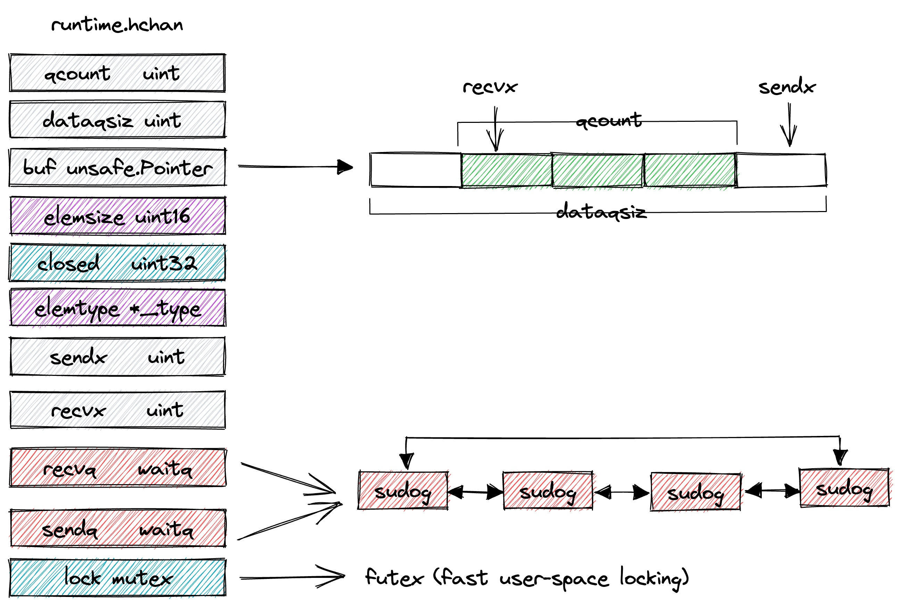
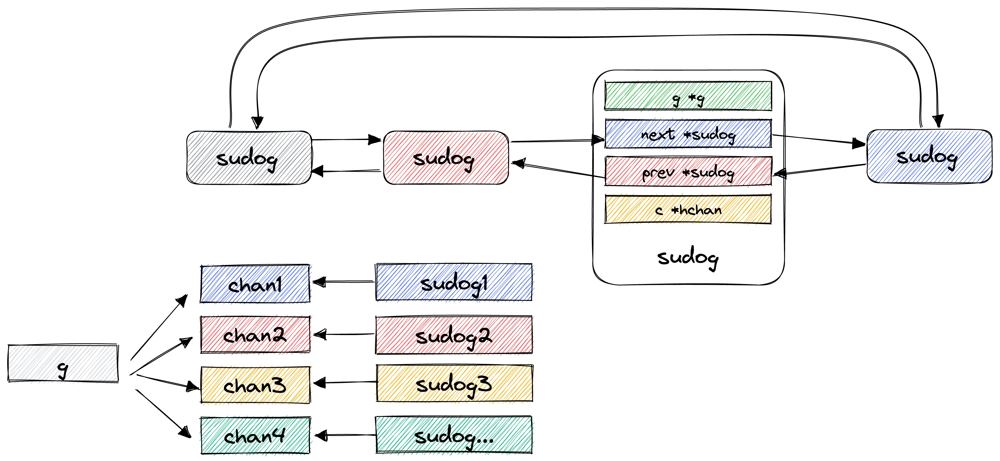
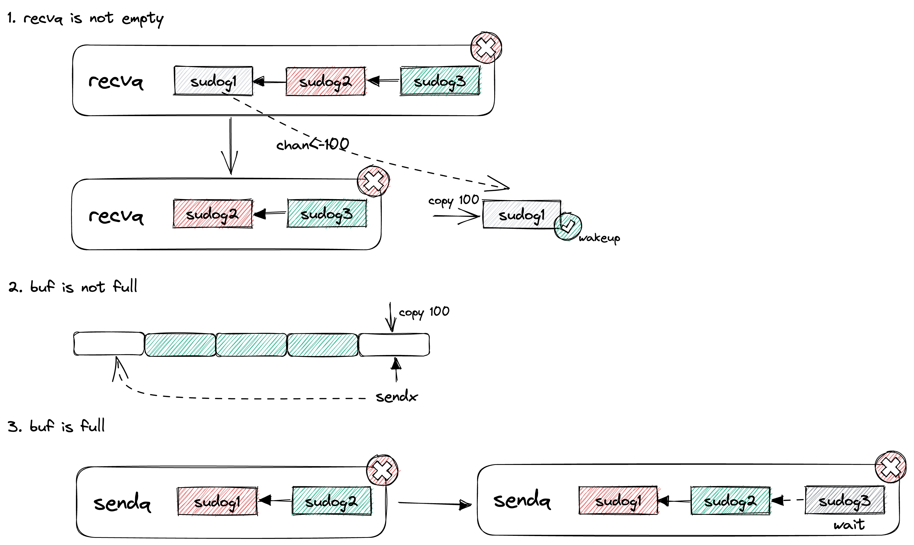
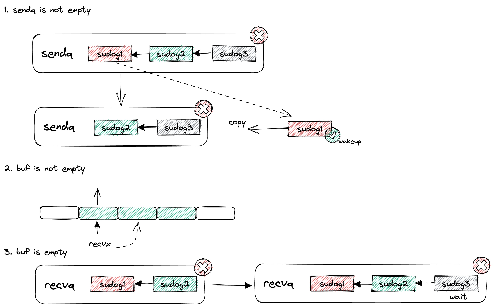
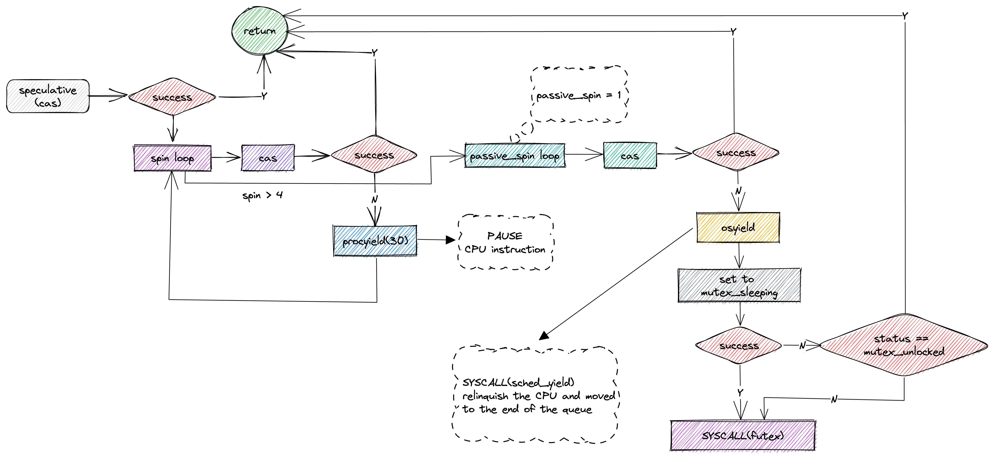

# Disruptor

## chan

当竞争非常大而且是大量的元素需要通过 chan 传递时，对于 chan 而言其整体大部分时间是出于系统调用上，性能会下降非常明显。

即使开启了 ringbuffer 的有缓冲模式，也会存在容量打满，元素无法放入到 chan，造成阻塞的情况。

至于元素会被阻塞多久才进入 chan 需要进一步的测试；是否在容量没有打满的情况下，元素会也会被阻塞，多久才进入 chan 也需要进一步的测试。

chan 使用的互斥锁是 `runtime.mutex`，在 linux 系统中它的实现是 futex，在没有竞争的情况下，会退化成为一个自旋操作，速度非常快，但是当竞争比较大时，它就会在内核中休眠。

## Unit test
`go test` 的构建的程序是没有进行 inline 的，所以使用接口的形式来实现的话，会有一定的性能损耗。

但是转向使用 `go run` 使用的 inline 的程序，就会发现性能提升了很多。

经过测试，会比非接口形式的实现还略快一点。

## Reference

github.com/bruceshao/lockfree
