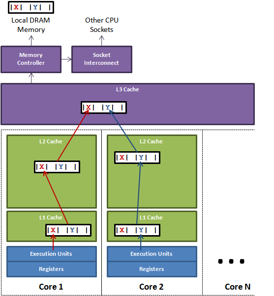
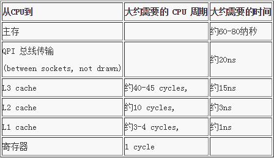
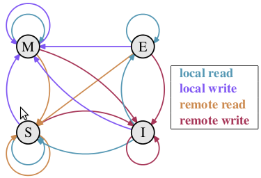

# False Sharing

伪共享的非标准定义为：
缓存系统中是以缓存行（cache line）为单位存储的，当多线程修改互相独立的变量时，如果这些变量共享同一个缓存行，就会无意中影响彼此的性能，这就是伪共享。

缓存行上的写竞争是运行在 SMP 系统中并行线程实现可伸缩性最重要的限制因素。

## Cache Line



比如 Go 一个 uint64 类型是 8 字节，因此在一个缓存行中可以存 8 个 uint64 类型的变量。

所以，如果你访问一个 uint64 数组，当数组中的一个值被加载到缓存中，它会额外加载另外 7 个，以致你能非常快地遍历这个数组。

事实上，你可以非常快速的遍历在连续的内存块中分配的任意数据结构。

但是如果你在数据结构中的项在内存中不是彼此相邻的（如链表），你将得不到免费缓存加载所带来的优势，并且在这些数据结构中的每一个项都可能会出现缓存未命中。

如果有多个线程操作不同的成员变量，但是相同的缓存行，就是发生了伪共享。

## 缓存命中耗时



每个核心都有自己的缓存，如果另外的核心里面的线程需要跨核心访问数据，就需要通过 QPI（Intel QuickPath Interconnect）总线来访问，这个过程是非常耗时的。

https://www.intel.com/content/www/us/en/docs/programmable/683888/current/qpi-overview.html

简单地说就是需要 memory controller 的参与。

现在通常的做法是，被访问的数据会从核心1发送到核心2的缓存，然后核心2再从自己的缓存中读取数据，这样就避免了 QPI 总线的参与。

## MESI 协议 & RFO

### MESI

M（修改，Modified）：本地处理器已经修改缓存行，即是脏行，它的内容与内存中的内容不一样，并且此 cache 只有本地一个拷贝(专有)；
E（独占，Exclusive）：缓存行内容和内存中的一样，而且其它处理器都没有这行数据；
S（共享，Shared）：缓存行内容和内存中的一样, 有可能其它处理器也存在此缓存行的拷贝；
I（无效，Invalid）：缓存行失效, 不能使用。



初始：一开始时，缓存行没有加载任何数据，所以它处于 I 状态。

本地写（Local Write）：如果本地处理器写数据至处于 I 状态的缓存行，则缓存行的状态变成 M。

本地读（Local Read）：如果本地处理器读取处于 I 状态的缓存行，很明显此缓存没有数据给它。此时分两种情况：(1)其它处理器的缓存里也没有此行数据，则从内存加载数据到此缓存行后，再将它设成 E 状态，表示只有我一家有这条数据，其它处理器都没有；(2)其它处理器的缓存有此行数据，则将此缓存行的状态设为 S 状态。（备注：如果处于M状态的缓存行，再由本地处理器写入/读出，状态是不会改变的）

远程读（Remote Read）：假设我们有两个处理器 c1 和 c2，如果 c2 需要读另外一个处理器 c1 的缓存行内容，c1 需要把它缓存行的内容通过内存控制器 (Memory Controller) 发送给 c2，c2 接到后将相应的缓存行状态设为 S。在设置之前，内存也得从总线上得到这份数据并保存。

远程写（Remote Write）：其实确切地说不是远程写，而是 c2 得到 c1 的数据后，不是为了读，而是为了写。也算是本地写，只是 c1 也拥有这份数据的拷贝，这该怎么办呢？c2 将发出一个 RFO (Request For Owner) 请求，它需要拥有这行数据的权限，其它处理器的相应缓存行设为 I，除了它自已，谁不能动这行数据。这保证了数据的安全，同时处理 RFO 请求以及设置I的过程将给写操作带来很大的性能消耗。


| 当前状态  | 触发事件 | 解释                                                               | 迁移状态 |
|-------|------|------------------------------------------------------------------|------|
| M 修改态 | 总线读  | 侦测到总线上有其他处理器在请求准备读取该行，刷新该行到内存，以方便其他处理能用到最新的数据，并更新状态为 S           | S    |
|       | 总线写  | 侦测到总线上有其他处理器试图请求来写该行（独占），刷新该行到内存，并设置本地的副本为 I 状态                  | I    |
|       | 处理器读 | 本地处理器对该行进行读操作，不需要改变状态                                            | M    |
|       | 处理器写 | 本地处理器对该行进行写操作，不需要改变状态                                            | M    |
| E 独占态 | 总线读  | 侦测到总线上有其他处理器在请求准备读取该行，因为本地处理器还没有对该行进行写操作，因此缓存内容与内存的一致，只需要改为 S 状态 | S    |
|       | 总线写  | 侦测到总线上有其他处理器试图请求来写该行（独占），设置为 I 状态                                | I    |
|       | 处理器读 | 本地处理器对该行进行读操作，不需要改变状态                                            | E    |
|       | 处理器写 | 本地处理器对该行进行写操作，需要进入 M 状态                                          | M    |
| S 共享态 | 总线读  | 侦测到总线上有其他处理器在请求准备读取该行，不需要改变状态                                    | S    |
|       | 总线写  | 侦测到总线上有其他处理器试图请求来写该行（独占），设置为 I 状态                                | I    |
|       | 处理器读 | 本地处理器对该行进行读操作，不需要改变状态                                            | S    |
|       | 处理器写 | 产生了一个试图写该行的信号到总线，需要进入 M 状态                                       | M    |
| I 无效态 | 总线读  | 侦测到总线上有其他处理器在请求准备读取该行，不需要改变状态                                    | I    |
|       | 总线写  | 侦测到总线上有其他处理器试图请求来写该行（独占），不需要改变状态                                 | I    |
|       | 处理器读 | Cache 不命中，产生一个读请求，送到总线上，内存数据到达 Cache 后进入 S 态                     | S    |
|       | 处理器写 | Cache 不命中，产生一个写请求，送到总线上，内存数据到达 Cache 后进入 M 态                     | M    |

### RFO

Request For Ownership 是一种缓存一致性协议，用于在多处理器系统中保持缓存的一致性。

前面第一张 cache line 的图中，如果不同核心的线程 1 和线程 2 都要修改同一个缓存行，但是(core1)线程 1 修改 X，(core2)线程 2 修改 Y，这两个频繁改动的变量都处于同一条缓存行。

两个线程就会轮番发送 RFO (缓存锁)，占得此缓存行的拥有权。

当 core1 取得了拥有权开始更新 X，则 core2 对应的缓存行需要设为 I 状态。

当 core2 取得了拥有权开始更新 Y，则 core1 对应的缓存行需要设为 I 状态(失效态)。

轮番夺取拥有权不但带来大量的 RFO 消息，而且如果某个线程需要读此行数据时，L1 和 L2 缓存上都是失效数据，只有 L3 缓存上是同步好的数据。

读 L3 的数据非常影响性能。更坏的情况是跨槽读取，L3 都要 miss，只能从内存上加载。

## 解决伪共享的思路

让不同的线程操作的对象处于不同的 cache line 中

使用 padding 的方式，占据空间，go 里面的结构没有 java 里面的对象头固定占 8 字节(32位系统)或 12 字节( 64 位系统默认开启压缩, 不开压缩为 16 字节)，直接填充空间即可。

隐蔽的伪共享问题，比如双向链表的哨兵头结点和尾结点，可能会被放在同一个缓存行中，在不断更新头尾指向（数据结点）的时候，这样会导致频繁的 RFO 消息。

# Memory Barrier

这里需要先介绍一下 CPU 的乱序执行（out-of-order execution）。

它主要是为了提高 CPU 的执行效率，CPU 会在不改变程序执行结果的前提下，对指令进行重排序。

这种排序主要是内存排序，是 CPU 访问主存的顺序，而不是代码的顺序。

它在编译器编译时发生或者是在 CPU 运行时发生。

为了避免乱序执行带来一些问题，需要内存屏障（memory barrier）来确保多线程的同步。

乱序访问主要发生在两个阶段：

1. 编译时，编译器优化导致内存乱序访问（指令重排）。这种时候使用编译时内存屏障。

2. 运行时，多 CPU（Symmetric multiprocessor，SMP）间交互引起内存乱序访问。这种时候使用运行时内存屏障（硬件内存屏障）。
    - happens-before: 按照程序的代码顺序执行。
    - synchronized-with: 两个线程之间的同步，对于同一个原子操作，需要同步关系，store 一定要先于 load

SMP 系统：
- 在 SMP 中，同一个线程的原子操作还是会按照代码顺序执行，但是不同线程之间的执行是任意的（顺序一致，Sequential Consistency）
- 如果某个操作只要求是原子操作，除此之外不需要其他同步保障，就能使用松弛一致（Relaxed Consistency）来允许某种类型的重排序
- 读写任意排序，需要受制于显式的内存屏障（memory barrier）来保证一致性（Weak Consistency）

常用场景：
- 实现同步原语（synchronization primitives）
- 实现无锁数据结构（lock-free data structures）
- 驱动程序（device drivers）

https://gfw.go101.org/article/memory-model.html#mutex

## 指令实现
x86的lock#指令前缀（prefix）主要解决原子性（atomicity）的问题，同时隐含了内存屏障（memory barrier）。

相当于这条原子指令执行结束后，写到内存地址的内容是对其他核心都可见的。

还有其他方式是通过锁总线完成的。

https://www.kernel.org/doc/Documentation/memory-barriers.txt

https://lwn.net/Articles/847481/

- smp_wmb()
- smp_rmb()
- smp_mb()
- mb()

参考 linux kernel kfifo 的实现：
> 索引 in & out，会被两个不同的线程访问，它们共同指明了 ringbuff 中的实际数据边界。
> 也就是它们本身与 ringbuffer 的数据存在访问上的顺序关系，在没有使用锁的同步机制，
> 要保证顺序关系的正确性，就需要使用 memory barrier。
> `unsigned int __kfifo_put(struct kfifo *fifo, const unsigned char *buffer, unsigned int len)`
> 先通过 in 和 out 来确定可以向 ringbuffer 中写入数据量的多少，这时，out 索引应该先被读取后才能真正的将用户 
> buffer 中的数据写入缓冲区，因此这里会使用到了 smp_mb()。
> in 索引在 put 的函数中，需要先在 ringbuffer 中写入数据后才能被修改，需要通过 smp_wmb() 来完成。
> `unsigned int __kfifo_get(struct kfifo *fifo, unsigned char *buffer, unsigned int len)`
> 同样地，读使用 smp_mb() 来确保修改 out 索引之前 ringbuffer 中数据已经被成功读取并写入用户 buffer 中了。
> 通过 smp_rmb() 保证先读取 in 的索引（确定要读取多少数据）再去读取 ringbuffer 的数据。

```c
#include <linux/kernel.h>
#include <linux/module.h>
#include <linux/slab.h>
#include <linux/err.h>
#include <linux/kfifo.h>
#include <linux/log2.h>

unsigned int __kfifo_put(struct kfifo *fifo, 
                         const unsigned char *buffer,
                         unsigned int len)
{
    usigned int l;
    len = min(len, fifo->size - fifo->in + fifo->out);
    smp_mb();
    l = min(len, fifo->size - (fifo->in & (fifo->size-1)));
    memcpy(fifo->buffer+(fifo->in & (fifo->size-1)), buffer, l);
    memcpy(fifo->buffer, buffer+l, len-l);
    smp_wmb();
    fifo->in += len;
    return len;
}
EXPORT_SYMBOL(__kfifo_put);

unsigned int __kfifo_get(struct kfifo *fifo,
                         unsigned char *buffer,
                         unsigned int len)
{
    unsigned int l;
    len = min(len, fifo->in - fifo->out);
    smp_rmb();
    l = min(len, fifo->size - (fifo->out & (fifo->size-1)));
    memcpy(buffer, fifo->buffer+(fifo->out & (fifo->size-1)), l);
    memcpy(buffer+l, fifo->buffer, len-l);
    smp_mb();
    fifo->out += len;
    return len;
}
EXPORT_SYMBOL(__kfifo_get);
```

### x86 UP
```c
// smp_wmb(), smp_rmb(), smp_mb() and mb()
#define barrier() __asm__ __volatile__("": : :"memory")
```

### x86 SMP
```c
// smp_wmb(), smp_rmb(), smp_mb() and mb() CONFIG_X86_32
#define mb() alternative("lock; addl $0,0(%%esp)", "mfence", X86_FEATURE_XMM2)
#define rmb() alternative("lock; addl $0,0(%%esp)", "lfence", X86_FEATURE_XMM2)
#define wmb() alternative("lock; addl $0,0(%%esp)", "sfence", X86_FEATURE_XMM)
// x64
#define mb() asm volatile("mfence":::"memory")
#define rmb() asm volatile("lfence":::"memory")
#define wmb() asm volatile("sfence" ::: "memory")
```
asm volatile 严禁在此处汇编语句与其它语句重组优化，memory强制编译器假设RAM所有内存单元均被汇编指令修改，"sfence" ::: 表示在此插入一条串行化汇编指令sfence。
- mfence：串行化发生在mfence指令之前的读写操作
- lfence：串行化发生在mfence指令之前的读操作、但不影响写操作
- sfence：串行化发生在mfence指令之前的写操作、但不影响读操作

由于x86的32位CPU有可能不提供mfence、lfence、sfence三条汇编指令的支持，故在不支持mfence的指令中使用："lock; addl $0,0(%%esp)", "mfence"。lock表示将“addl $0,0(%%esp)”语句作为内存屏障。

关于lock的实现：cpu上有一根pin #HLOCK连到北桥，lock前缀会在执行这条指令前先去拉这根pin，持续到这个指令结束时放开#HLOCK pin，在这期间，北桥会屏蔽掉一切外设以及AGP的内存操作。
也就保证了这条指令的atomic。

# RingBuffer

- Circular Queue
- Cyclic Buffer
- Circular Buffer

固定大小的缓冲区，先进先出，新的数据会覆盖旧的数据。

要想存放变长数据类型，应当存放指针（引用类型）。

单生产-消费模式是无锁的（同一线程）

使用无符号整数，可以不用担心溢出问题，因为溢出后会自动从 0 开始（回绕）。

## Linux kfifo

## Linux eventfd