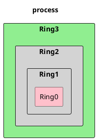
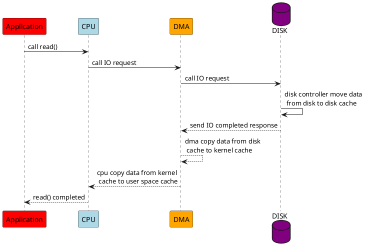

# Linux Zero-Copy

进程运行空间和内核的关系:  
Ring3 就是进程所在的用户空间，只能访问受限资源，不能直接访问内存等硬件设备，必须通过系统调用陷入到内核中，才能访问这些特权资源。  
Ring0 就是内核空间。


## CPU 上下文切换
系统调用会触发 CPU 的上下文切换（CPU 寄存器和 PC 程序计数器）。保存下来的上下文，会存储在系统内核中，并在任务重新调度执行时再次加载进来。这样就能保证任务原来的状态不受影响，让任务看起来还是连续运行。  
系统调用过程中，并不会涉及到虚拟内存等进程用户态的资源，也不会切换进程。系统调用过程中一直是同一个进程在运行。  

## 进程上下文切换
进程的切换只能发生在内核态。所以，进程的上下文不仅包括了虚拟内存、栈、全局变量等用户空间的资源，还包括了内核堆栈、寄存器等内核空间的状态。  
每次上下文切换都需要几十纳秒到数微秒的 CPU 时间。  
Linux 通过 TLB（Translation Lookaside Buffer）来管理虚拟内存到物理内存的映射关系。当虚拟内存更新后，TLB 也需要刷新，内存的访问也会随之变慢。特别是在多处理器系统上，缓存是被多个处理器共享的，刷新缓存不仅会影响当前处理器的进程，还会影响共享缓存的其他处理器的进程。  

每个进程都有自己的独立内存空间，一个新进程的建立就会把对应的内存空间建立起来。但是这块空间实际上是虚拟内存，要映射到真正的物理内存上的，而映射要靠页表。

## 线程上下文切换
线程是调度的基本单位，而进程则是资源拥有的基本单位。  
当进程拥有多个线程时，这些线程会共享相同的虚拟内存和全局变量等资源。
1. 前后两个线程属于不同进程。此时，因为资源不共享，所以切换过程就跟进程上下文切换是一样。
2. 前后两个线程属于同一个进程。此时，因为虚拟内存是共享的，所以在切换时，虚拟内存这些资源就保持不动，只需要切换线程的私有数据、寄存器等不共享的数据。

## 中断上下文切换
中断会导致 CPU 上下文切换。
1. 硬中断
2. 软中断

## 一次文件拷贝的流程



- 用户态
  - 应用程序的缓冲区，read()，write() 都是调用的 CPU copy，就会出现状态切换
- 内核态
  - 内核缓冲区
  - socket 缓冲区
- DMA
  > 硬件层的数据到内核缓冲，DMA copy
  >
- 硬件层
  - 硬盘
  - 网卡

## zero-copy 在 linux 的实现

- mmap & write
  将 kernel space 中 read cache address 和 user space app cache 进行映射，实现两个空间的 cache 共享。传输大文件还行，但是小文件可能会出现 缓存碎片，多进程同时操作文件可能会出现 coredump。
  ```c
  // 加锁，之后解锁
  buf = mmap(diskfd, len);
  write(sockfd, buf, len);
  ```
  ```plantuml
  @startuml
  title mmap & write
  skinparam BackgroundColor transparent
  skinparam componentStyle rectangle

  component "user space" as us {
      component application {
          ["mapping share mem"] #lightblue
          ["rest user app cache mem"]
      }
  }

  component "kernel space" as ks {
      ["socket buffer"] #purple
      ["kernel cache"] #lightblue
  }

  component "hardware" {
      ["disk"] #pink
      ["NIC"] #green
  }

  us <--> ks: mmap() & write()
  ["mapping share mem"] <-> ["kernel cache"]: 直接这部分空间是做映射的
  ["kernel cache"] -> ["socket buffer"]: CPU copy
  ["kernel cache"] <.. ["disk"]: DMA copy
  ["socket buffer"] ..> ["NIC"]: DMA copy
  @enduml
  ```
- sendfile
  只能是从 file 到 socket fd
  ```c
  #include<sys/sendfile.h>
  ssize_t sendfile(int out_fd, int in_fd, off_t *offset, size_t count);
  ```

  ```plantuml
  @startuml
  title sendfile
  skinparam BackgroundColor transparent
  skinparam componentStyle rectangle

  component "user space" as us {
      component application {
          ["app cache"] #lightblue
      }
  }

  component "kernel space" as ks {
      ["socket buffer"] #purple
      ["kernel cache"] #lightblue
  }

  component "hardware" {
      ["disk"] #pink
      ["NIC"] #green
  }

  ["app cache"] -> ["kernel cache"]: syscall sendfile()
  ["app cache"] <.. ["socket buffer"]: syscall sendfile()
  ["kernel cache"] -> ["socket buffer"]: CPU copy
  ["kernel cache"] <.. ["disk"]: DMA copy
  ["socket buffer"] ..> ["NIC"]: DMA copy
  @enduml
  ```
- sendfile & DMA copy
  Linux 2.4 对 syscall sendfile 进行了优化，但是需要硬件支持 DMA。升级之后，sendfile 直接把 kernel space cache 的数据信息（fd，data length<i.e. address offset>) 记录到 kernel space socket buffer，此后，DMA 直接根据 kernel space socket buffer 中记录信息去 kernel space cache 中拷贝到 NIC。

  ```plantuml
  @startuml
  title sendfile & DMA copy
  skinparam BackgroundColor transparent
  skinparam componentStyle rectangle

  component "user space" as us {
      component application {
          ["app cache"] #lightblue
      }
  }

  component "kernel space" as ks {
      ["socket buffer"] #purple
      ["kernel cache"] #lightblue
  }

  component "hardware" {
      ["disk"] #pink
      ["NIC"] #green
  }

  ["app cache"] -> ["kernel cache"]: syscall sendfile()
  ["app cache"] <.. ["socket buffer"]: syscall sendfile()
  ["kernel cache"] -> ["socket buffer"]: copy Fd & data length
  ["kernel cache"] <.. ["NIC"]: DMA collection & copy
  ["kernel cache"] <.. ["disk"]: DMA copy

  @enduml
  ```
- splice

  Linux 在 2.6 版本引入的，其不需要硬件支持，并且不再限定于socket上，实现两个普通文件之间的数据零拷贝。
  在内核缓冲区和socket缓冲区之间建立管道来传输数据，避免了两者之间的 CPU 拷贝操作。

  ```c
  #include <fcntl.h>
  ssize_t splice(int fd_in, loff_t *off_in, int fd_out, loff_t *off_out, size_t len, unsigned int flags);
  // out_fd : 待写入内容的文件描述符
  // off_out : 待写入文件描述符的偏移量，如果文件描述符为管道则必须为空
  // in_fd : 待读出内容的文件描述符
  // off_in : 待读出文件描述符的偏移量，如果文件描述符为管道则必须为空
  // len : 需要复制的字节数
  ```

  ```plantuml
  @startuml
  title splice
  skinparam BackgroundColor transparent
  skinparam componentStyle rectangle

  component "user space" as us {
      component application {
          ["app cache"] #lightblue
      }
  }

  component "kernel space" as ks {
      ["socket buffer"] #purple
      ["kernel cache"] #lightblue
  }

  component "hardware" {
      ["disk"] #pink
      ["NIC"] #green
  }

  ["app cache"] -> ["kernel cache"]: syscall splice()
  ["app cache"] <.. ["socket buffer"]: return splice
  ["kernel cache"] -> ["socket buffer"]: built file transport pipe
  ["kernel cache"] <.. ["disk"]: DMA copy
  ["socket buffer"] ..> ["NIC"]: DMA copy
  @enduml
  ```
- Copy on Write
  写时复制，这种时候是数据不得不从 user space 和 kernel space 中切换
- *PageCache
  Linux 2.6 引入的，其通过将磁盘上的数据缓存到内存中，来减少磁盘 IO 操作。  
  读取文件时，是先把磁盘文件拷贝到 PageCache 上，再拷贝到进程中。  
  PageCache 的 IO 我们称为缓存 IO，它与虚拟内存系统耦合太紧，导致下面的 Async IO 从诞生起到现在都不支持缓存 IO。
- *Async IO & Direct IO
  Direct IO 绕过了 PageCache，直接从磁盘读取数据。
  Async IO 则是在读取数据时，先将数据从内核空间拷贝到用户空间，然后再从用户空间返回。

总的思想都是减少空间切换和让 CPU 把一块数据移动到另一块区域上。

> Refs:  
> 1. https://strikefreedom.top/archives/linux-io-and-zero-copy
> 2. https://github.com/acln0/zerocopy
> 3. https://pkg.go.dev/internal/poll